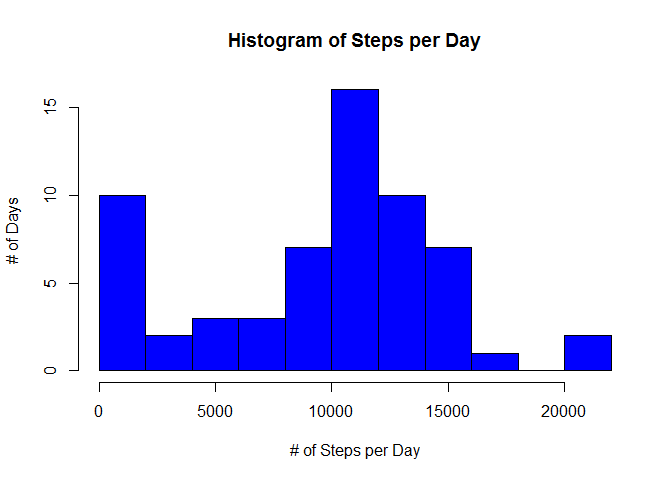
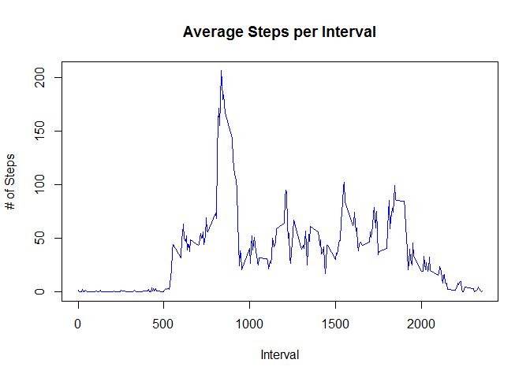
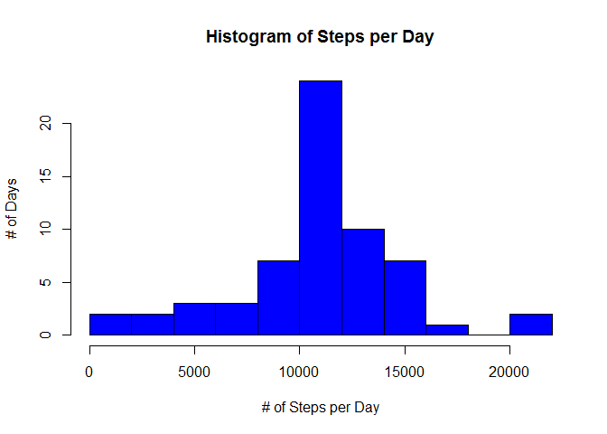
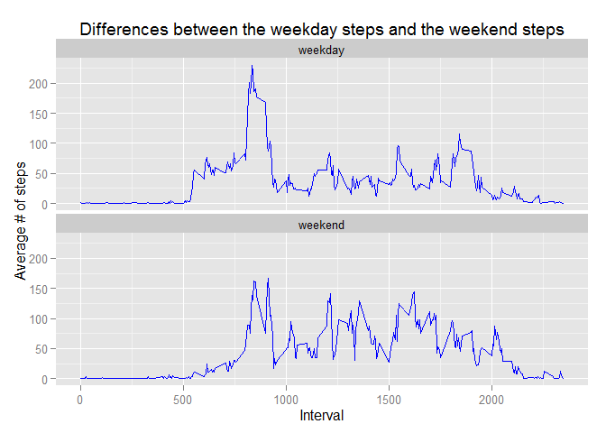

# Reproducible Research: Peer Assessment 1
Antonio Adsuar  
June 13, 2015  
<!-- I've tried to include an abstract in the document:

  abstract: Implementation of the first peer assessment of the Coursera's **Reproducible Research** course.
  
  But I've not been able to activate such option.
-->


## Introduction
The current document is a review of the complete implementation of the *First Peer Assessment* of the Coursera **Reproducible Research** course.

The main goal of the task is to write a report in a single R markdown document that can be processed by knitr and be transformed into an HTML file, that solves the different required tasks.

With the aim of developing such task, and that the solution can be transformed not just into HTML but as well into DOCX and PDF, please find below the software requirements to be able to reproduce smoothly the **Rmd** document.

Finally, for the final task, the locale with which I've been working is **LC_TIME=Spanish_Spain**.

### OS

I've successfully tested the solution in the following **OS**:

- ***Windows 7***
- ***Linux Ubuntu 14.04***

### Related Software

- ***RStudio 0.99.442***
- ***R version 3.2.0 (2015-04-16)***
- ***MiKTeX 2.9***

## Loading and preprocessing the data

### Loading the data

In first place, I load the data. The code is prepared to load data in Linux as well as in Windows systems, so the load is done taking into account the OS to access to the folder in which the data is stored at.


```r
activity <- NA

if(grepl("linux",R.version$os, ignore.case = T)) {
  activity <- read.csv("activity/activity.csv", header=T, na.strings=c("NA","N/A"),stringsAsFactors=F)
} else {
  if(grepl("w32|w64",R.version$os, ignore.case = T)) {
    activity <- read.csv("activity\\activity.csv", header=T, na.strings=c("NA","N/A"),stringsAsFactors=F)
  }
}
```

### Preprocessing the data

The date column is loaded as character strings. Thus, if I want to play around with dates, I'll need to transform such column into a **Date** format.

```r
activity$date <- as.Date(activity$date,"%Y-%m-%d")
```

## What is mean total number of steps taken per day?

### Calculate the total number of steps taken per day


```r
steps_per_day <- aggregate(activity$steps,by=list(Category=activity$date), FUN=sum, na.rm=T, na.action=NULL)

# I change the name of the columns to be more readable
colnames(steps_per_day) <- c("date","steps")
```

With this configuration, the days with no registers (NA values) will be considered as days with no steps. Such decision will affect to the upcoming results.

### Make a histogran of the total number of steps taken per day

Please find below the histogram with the frequency of dates with a given number of steps. I've modified the histogram so the range of steps is wider than default.


```r
hist(steps_per_day$steps, main="Histogram of Steps per Day", ylab="# of Days", xlab="# of Steps per Day", breaks=10, col="blue")
```

 


### Calculate and report the mean and median


```r
mean.steps <- mean(steps_per_day$steps, na.rm=T)
median.steps <- median(steps_per_day$steps, na.rm=T)
```


The mean value of the total number of steps taken per day is **9354.23**, and the median is **10395**.

## What is the average daily activity pattern?

### Make a time series plot of the 5-minute interval

I group the results per interval.


```r
steps_per_interval <- aggregate(activity$steps,by=list(Category=activity$interval), FUN=mean, na.rm=T, na.action=NULL)

# I change the name of the columns to be more readable
colnames(steps_per_interval) <- c("interval","mean_steps")
```

Once I get the average number of steps per interval, I can make the plot.


```r
plot(steps_per_interval,type="l",col="blue",main="Average Steps per Interval", xlab="Interval", ylab="# of Steps")
```

 

### Which of the 5-minute interval contains the maximum number of steps?


```r
max_steps <- max(steps_per_interval$mean_steps)
max_interval <- steps_per_interval$interval[which.max(steps_per_interval$mean_steps)]
```

The interval with the greater average number of steps per interval is the interval **#835**, with an average number of steps of **206.17**.

## Imputing missing values

### Calculate and report the total number of missing values

The calculation of the total number of missing values in the dataset can be made combining the functions **is.na()** (that will identify which steps are not available) with **sum()** (to get the number of steps that meet the condition).


```r
na_values <- sum(is.na(activity$steps))
```

Thus, the total number of missing values is **2304**.

### Devise a strategy for filling in all of the missing values in the dataset

My objective is to substitue each NA value per the average number of steps per interval (I could do it applying any other value but, since I already have the average values per interval, it's easier to implement.)

### Create a new dataset that is equal to the original dataset but with the missing data filled in


```r
activity_filled <- activity

for(i in 1:nrow(activity_filled)) {
  if(is.na(activity_filled[i,"steps"])) {
    intervalidx <- which(steps_per_interval$interval == activity_filled[i,"interval"])
    activity_filled[i,"steps"] <- steps_per_interval[intervalidx,"mean_steps"]
  }
}
```

### Make a histogram of the total number of steps taken each day

#### Calculate the total number of steps taken per day


```r
steps_per_day_filled <- aggregate(activity_filled$steps,by=list(Category=activity$date), FUN=sum, na.rm=T, na.action=NULL)

# I change the name of the columns to be more readable
colnames(steps_per_day_filled) <- c("date","steps")
```

#### Make a histogran of the total number of steps taken per day


```r
hist(steps_per_day_filled$steps, main="Histogram of Steps per Day", ylab="# of Days", xlab="# of Steps per Day", breaks=10, col="blue")
```

 


### Calculate and report the mean and median total number of steps taken per day


```r
meanfilled.steps <- mean(steps_per_day_filled$steps, na.rm=T)
medianfilled.steps <- median(steps_per_day_filled$steps, na.rm=T)
```


The mean value of the total number of steps taken per day is **10766.19**, and the median is **10766.19**.

- *Do these values differ from the estimates from the first part of the assignment?* As we can see in the results, and comparing them to the previous ones, it's obvious to see that the results are different.
- *What is the impact of imputing missing data on the estimates of the total daily number of steps?* The mean and median values tend to be equal, with the application of this kind of approach. Furthermore, since I considered in first place the NA values as zeros, the mean value was really low, and now it's been increased.

## Are there differences in activity patterns between weekdays and weekends?

### Create a new factor variable in the dataset


```r
activity_filled$daytype <- sapply(activity$date,function(x) {if(weekdays(x,abbreviate = TRUE) %in% c("sáb","dom")) "weekend" else "weekday"})
activity_filled$daytype <- as.factor(activity_filled$daytype)
```

### Split the data in two files according to the type of the day

I create two datasets, **activity_weekend** for the data about weekends, and **activity_weekday** for the data about the rest of the days of the week.


```r
activity_weekend <- activity_filled[activity_filled$daytype == "weekend",1:3]
activity_weekday <- activity_filled[activity_filled$daytype == "weekday",1:3]
```

### Calculate the steps per interval per dataset

#### Steps per interval for weekdays


```r
steps_per_interval_weekday <- aggregate(activity_weekday$steps,by=list(Category=activity_weekday$interval), FUN=mean, na.rm=T, na.action=NULL)
steps_per_interval_weekday$type <- "weekday"

# I change the name of the columns to be more readable
colnames(steps_per_interval_weekday) <- c("interval","mean_steps","type")
```

#### Steps per interval for weekends


```r
steps_per_interval_weekend <- aggregate(activity_weekend$steps,by=list(Category=activity_weekend$interval), FUN=mean, na.rm=T, na.action=NULL)
steps_per_interval_weekend$type <- "weekend"

# I change the name of the columns to be more readable
colnames(steps_per_interval_weekend) <- c("interval","mean_steps","type")
```

#### Create a new dataset with all the information


```r
steps_per_interval_global <- rbind(steps_per_interval_weekday,steps_per_interval_weekend)
```

### Make a panel plot

Once I get the average number of steps per interval, I can make the plot.


```r
library("ggplot2")
ggplot(steps_per_interval_global,aes(x=interval, y=mean_steps)) +
  geom_line(color="blue") +
  facet_wrap(~ type, nrow=2, ncol=1) +
  xlab("Interval") +
  ylab("Average # of steps") +
  ggtitle("Differences between the weekday steps and the weekend steps")
```

 

### Conclusions

As we can clearly see, there's a big difference between weekdays and weekends. On weekends, the steps are better distributed along the day (between 7 to 8am and 5 to 6pm) while on the rest of the week, it's common to concentrate the steps between 7 to 11am.
